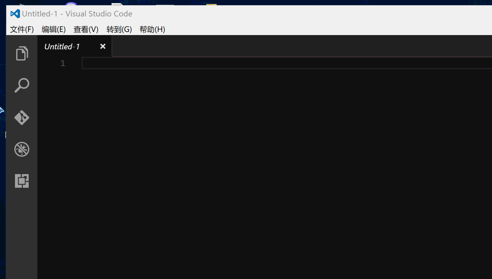

# note-samplej README

这是个人写的一个小插件，目前支持插入函数头说明，和文件头说明。

分别为：fun note 和 file note

## 插件安装说明
1.把工程下载下来，放到C:\Users\username\.vscode\extensions路径下；  
2.打开你的VScode，在需要的地方，按F1或者ctrl + shift + p,打开帮助栏；  
3.输入你需要的，file note或者fun note，回车。  

